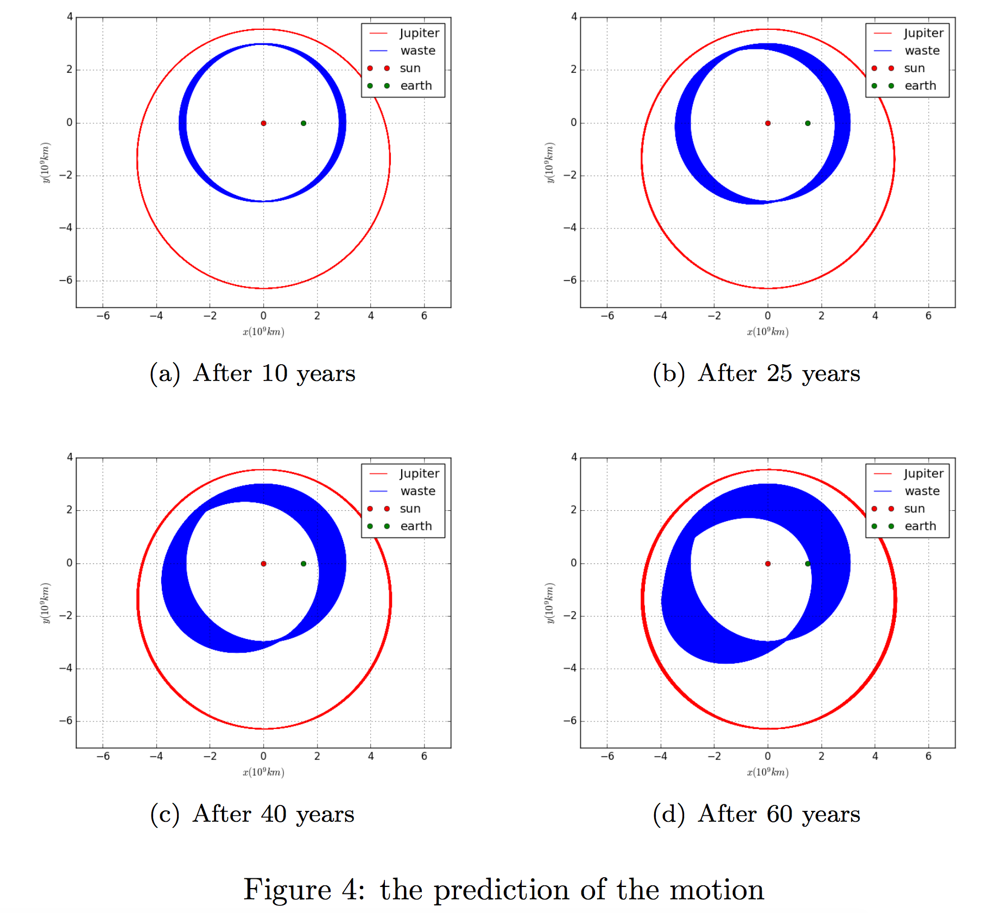

# 3BodySim

Simulate the motion of three body model - the sun, the Jupiter and the waste in UPC 2016 Problem A.

## Background

For University Physics Competition, see also [the official website](http://www.uphysicsc.com/2016contest.html). The problem is

> Problem A Reactor Waste Disposal

> The disposal of radioactive waste is a serious problem for the nuclear power industry.  One solution that has been proposed is to launch the waste into space, with the idea of either destroying the waste by allowing it to fall into the sun, or simply having it take up an orbit in the asteroid belt where the radioactive waste products would eventually decay.  Make a comparison of these two methods of waste disposal.  Which method would be easier to implement?  How long could the waste be safely stored in the asteroid belt?

The repo aims to provide a simulation when the waste manages to enter the orbit of the asteroid belt.

## Dependencies

Just `matplotlib` and `numpy`. A convenient way to install them is by `pip`.

```
git clone https://github.com/JasonQSY/3BodySim.git && cd 3BodySim
pip install numpy matplotlib
python 3BodySim.py
```

## Result

The is the result appeared in my final UPC thesis.



## Improvements

It seems that there won't be improvements further since the competition has finished...

## License

MIT License.
